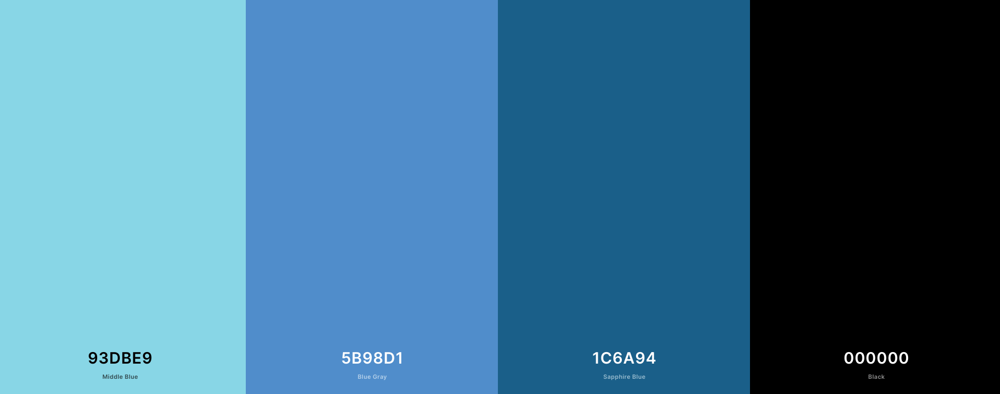
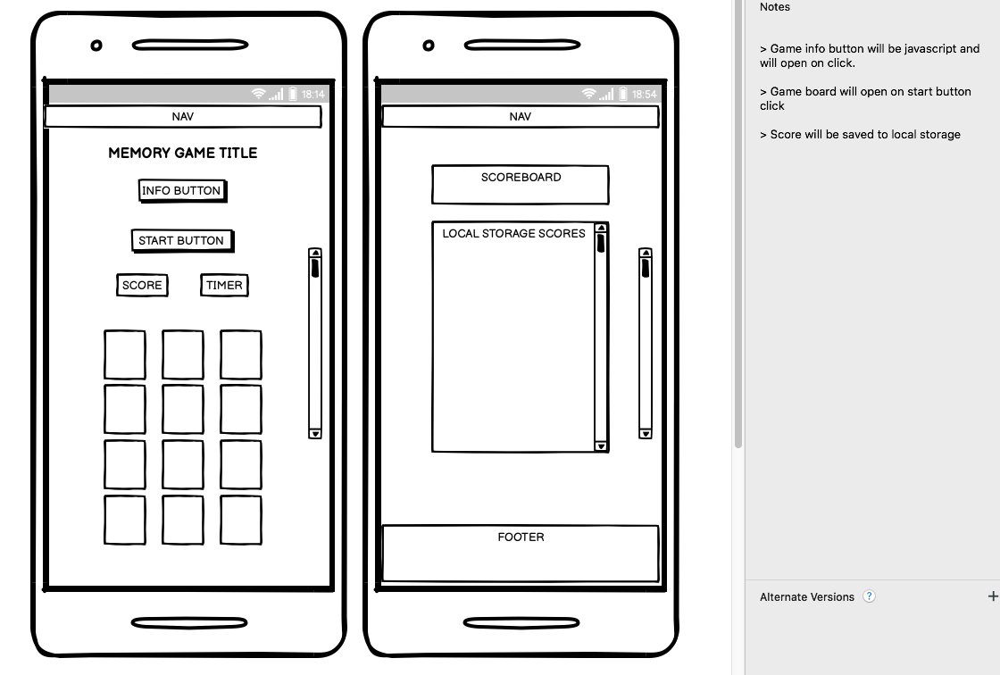
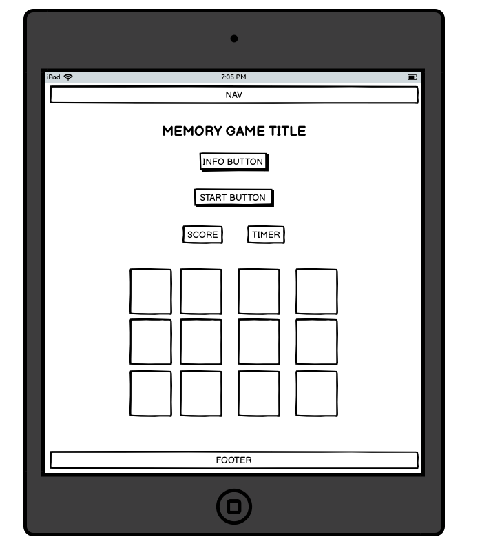
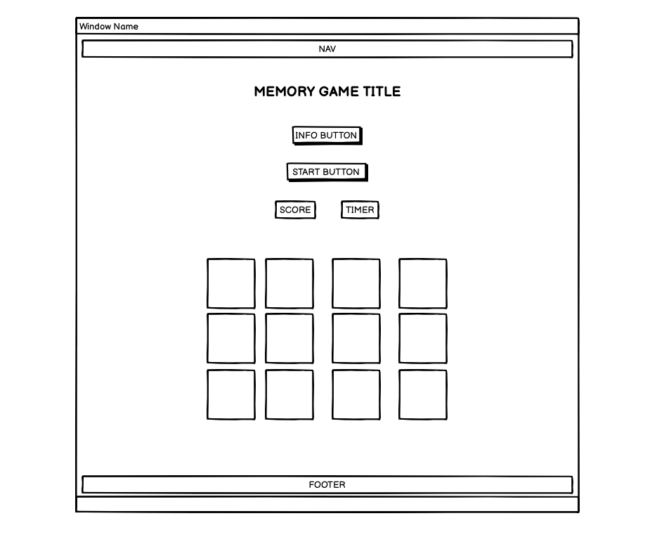
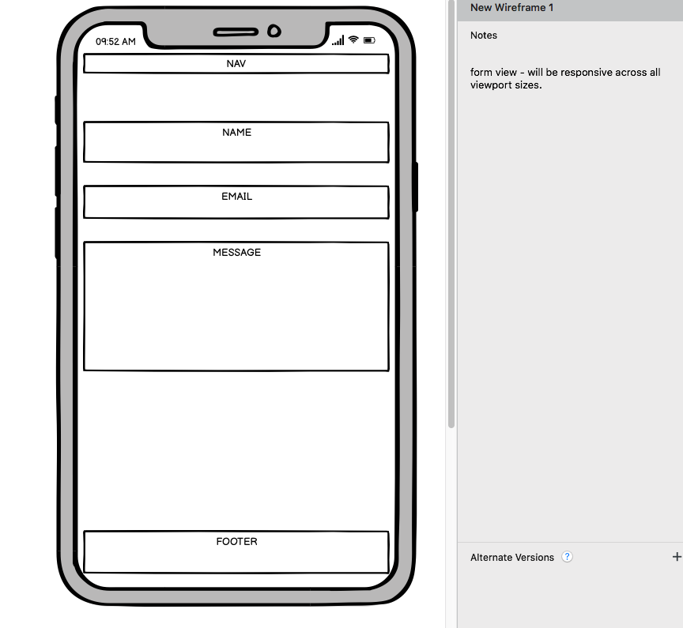
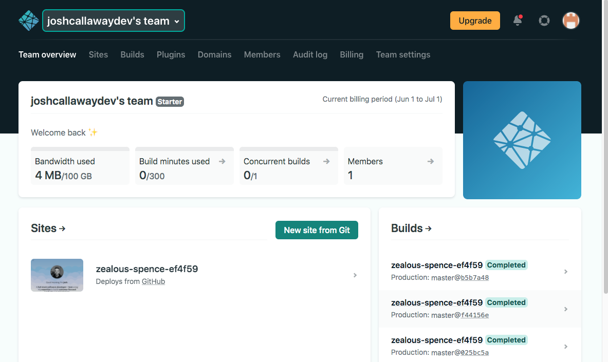
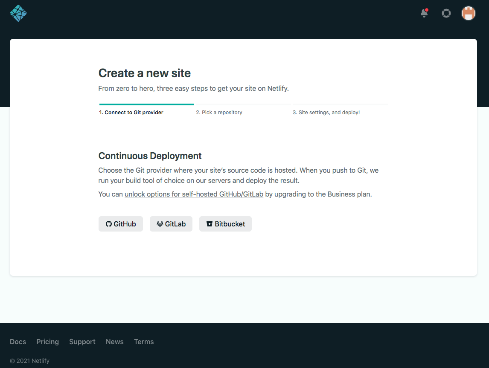
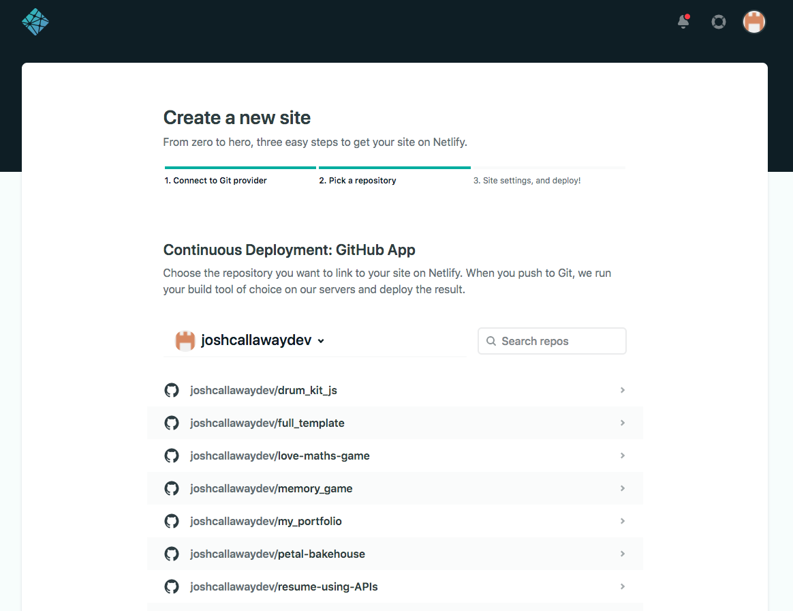
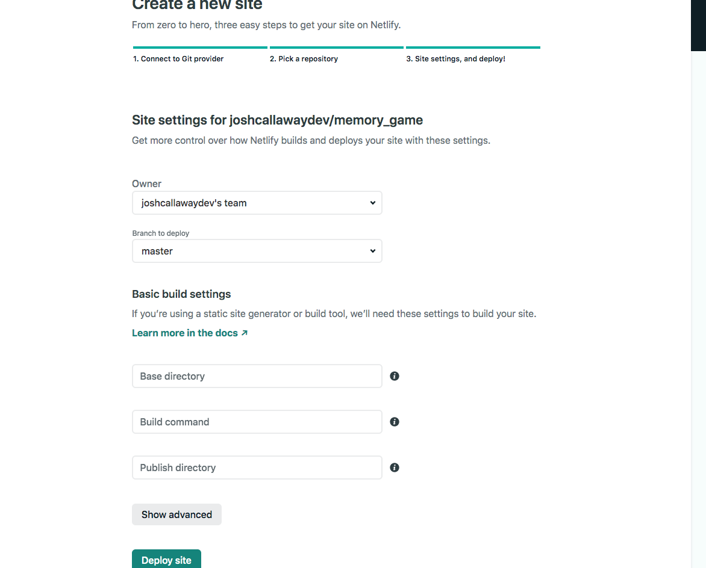
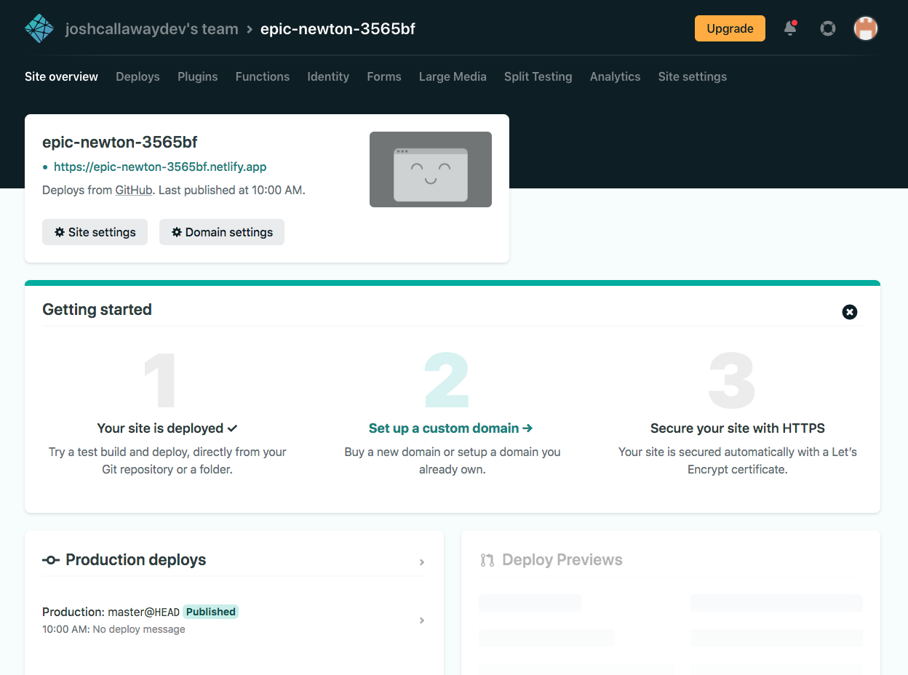

# Overview

I do not own the rights to the images used in this project, however in no way is this site to be used for monetary purposes.

This project is a javascript memory game. The objective of the site is to demonstrate my understanding of javascript. The site is built with HTML5, CSS3, Javascript and has access to the EmailJS service.

The game is designed to test peoples memory, and is fully interactive.

I chose Pokemon for the theme due to its place in popular culture, its ability to improve the game like feel and its enhanced ability to trend.

The core code is not my own, and was taken from an article. A link to the article can be found at the bottom of this file. The code has been refactored and features added / removed to suit my requirements. The theme was also changed.

# Table of Contents

* [User Experiance](#UX)
* [Design](#Design)
* [Technology / Features](#Technology)
* [Testing](#Testing)
* [Deployment](#Deployment)
* [Credit](#Credit)

# UX

1. First time - as a first time user i would like to

- play the game
- easily navigate the site
- understand how the game is played
- see my time and click rate

2. Returning - as a returning user i would like to

- see my scores
- play the game within 3 clicks (excluding any validation needed)

3. Frequent 

- see social media links
- contact the creator

# Design

### Color scheme

Background image was taken from loading.io (https://loading.io/) and used the chosen (above) colour scheme. With a budget, i would have animated the background so the lighter grandient moved around the page to improve the UX and game feel.

### Typography

All fonts were taken from Google font (https://fonts.google.com/).

- Body/Main Font - Inter

I chose this font for its readability at all sizes and at different case sensitivity.

- Header/Feature text Font - Zen Dot
- Body - Inter

I chose Xen Dot font to maximise UX and suit the game genre. Inter was chosen for its readabilty and clean design.

### Sizing

I chose REM as the primary unit metric due to its flexability with responsive design. I have also used PX with some containers for absolute sizing.

### Imagery

*I do not own the rights to these images. All images were taken from google.*

Card image - https://upload.wikimedia.org/wikipedia/en/3/3b/Pokemon_Trading_Card_Game_cardback.jpg

Pokemon -
1. https://i.pinimg.com/originals/18/d9/e1/18d9e1307018dbc76750ca7d5124fccd.png
2. https://assets.pokemon.com/assets/cms2/img/pokedex/full/001.png
3. https://trulyoutofcharacter.files.wordpress.com/2018/05/250px-006charizard.png
4. https://giantbomb1.cbsistatic.com/uploads/scale_medium/0/6087/2437349-pikachu.png
5. https://www.freeiconspng.com/uploads/pokeball-icon-23.png
6. https://assets.pokemon.com/assets/cms2/img/pokedex/detail/007.png

### UI/Site Design

I used Balsamiq to design the site.

Mobile view

Midsize view

Desktop view

Form design

### Design rationale - strategy, scope, structure, skeleton, surface

The game was designed to help users improve decision making and improve memory and focus.

I used a simple flexable design that made sure all major functionality and calls to action were immediatly present, making the site easier to use and understand.

I implemented validation in the form of name input so that the timer was not immediatly started, before the user could learn how to play. This removed friction and reduced frustration for users.

I decided to have the scoring table present, under the game board so that it was immediatly present after a user had completed a round, and moved with the flow of ones eye and the flow/direction of the site.

The colour scheme and background were chosen to improve the asthetics of the game, match the theme and be easy on the eye.

# Technology

### Languages

1. HTML5
2. CSS3
3. Javascript (vanilla js)

### Framework/Features

- Javascript
- Email.js
- Google Fonts
- Git
- Gitpod
- Balsamiq
- Responsiveness
- Hover:css
- Local Storage
- Font Awesome Icons

# Testing

Please see TESTING file within the DOCs folder. Link below.

https://github.com/joshcallawaydev/memory_game/blob/master/docs/TESTING.md

# Deployment

The site is deployed with Netlify. I chose Netlify for its ease of use and ability to keep all my deployments in one place.

- Deployment instructions below

1. Navigate to https://www.netlify.com
2. Login or create an account (a standard account is free)
3. Navigate to your team Overview
4. Click the 'New site from git' button

5. Choose location where your repo is stored

6. Click the relevent repo

7. Click 'Deploy site' button

8. You will get confirmation the site is deployed on the next screen. Here you can set up a custom domain and or generate a HTTPS certificate to secure your site. Please note your site is deployed with a Lets Encript certificate which comes free of charge.

### Forking the repo

By forking the GitHub Repo, you make a copy of the original repository on your GitHub account to view and/or make changes without affecting the original repository. To do this, please follow the below steps...

1) Log in to GitHub and locate the GitHub Repository
2) At the top of the Repository (not top of the page) just above the "Settings" Button on the menu, locate the "Fork" Button
3) Click the fork button
4) You should now have a copy of the original repository in your GitHub

### Cloning the repo

1) Log in to GitHub and locate the GitHub Repo
2) Under the repo name, click 'code' to veiw the repo URL or download the ZIP file.
3) To clone the repository using HTTPS, under "Clone with HTTPS", copy the link.
4) Open terminal
5) Change the current working directory to the location where you want the cloned directory to be made.
6) Type git clone, and then paste the URL you copied in Step 3.
    $ git clone https://github.com/*repo-name*
7) Press Enter. Your local clone will be created.

# Credit

Memory Game original code - https://dev.to/fakorededamilola/create-a-memory-game-with-js-1l9j

Email JS work was taken from the Code Institute Interactive Frontend Development module.
