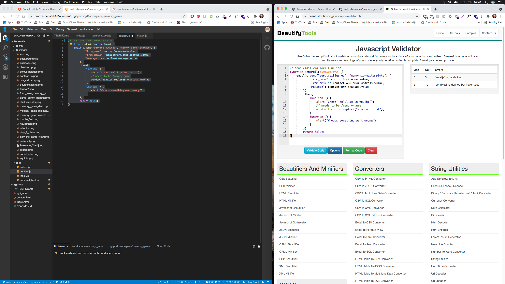

# Overview

Below is the extensive testing performed on this project. Testing was compiled throughout the project in effort to minimise bugs and styling issues.

# Table of contents

* [User stories](#User-stories)
* [Dev Tools testing](#Dev-Tools-testing)
* [Validators](#Validators)

# User stories

The site works seamlessly across all viewport sizes but was built mobile first.

The image below does not represent the phone size at which the site was designed at. Just a representation that mobile first was the approach.

In effort to improve UX/UI i regularly tested the site functionality and responsiveness. This way I could see UX/UI issues first hand and deploy changes in accordance with our principles. I also drafted in friends to attempt to break the site's viewing experience and functionality.

### UX Testing

1. First time - as a first time user i would like to

- play the game

- easily navigate the site

- understand how the game is played

- see my time and click rate

2. Returning - as a returning user i would like to

- see my scores

- play the game within 3 clicks (excluding any validation needed)

3. Frequent 

- see social media links

- contact the creator

# Dev Tools testing

Below is an image of me stepping through the code in chrome dev tools. This helped in improving my understanding of how the code worked and monitor functionality

# Validators

I used established online validators for testing the code base.

### HTML

No issues found in HTML validation.

### CSS

No issues found with the CSS validation.

### Javascript

All javascript files were ran through a validator. A few minor changes needed where functions were passing parameters that did not exist. Some visual changes needed in line with javascript best practice. Evidance below.

- Index.js

- personal_best.js

- contact.js

- button.js

