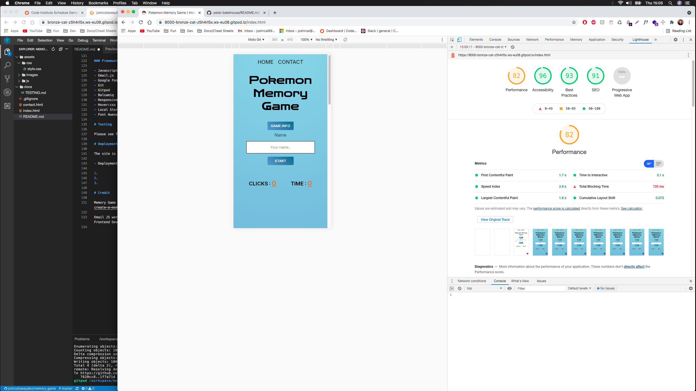

# Overview

Below is the extensive testing performed on this project. Testing was compiled throughout the project in effort to minimise bugs and styling issues.

# Table of contents

* [User stories](#User-stories)
* [Dev Tools testing](#Dev-Tools-testing)
* [Validators](#Validators)
* [Issues Faced](#Issues-Faced)

# User stories

The site works seamlessly across all viewport sizes but was built mobile first.

The image below does not represent the phone size at which the site was designed at. Just a representation that mobile first was the approach.

In effort to improve UX/UI i regularly tested the site functionality and responsiveness. This way I could see UX/UI issues first hand and deploy changes in accordance with our principles. I also drafted in friends to attempt to break the site's viewing experience and functionality.

### UX Testing

1. First time - as a first time user i would like to

- play the game

- easily navigate the site

- understand how the game is played

- see my time and click rate

2. Returning - as a returning user i would like to

- see my scores

- play the game within 3 clicks (excluding any validation needed)

3. Frequent 

- see social media links

- contact the creator

# Dev Tools testing

I used Dev Tools primarily however also tested across other major browsers, Firefox and Safari.

Below is an image of me stepping through the code in chrome dev tools. This helped in improving my understanding of how the code worked and monitor functionality

- Lighthouse score

- Firefox testing

- Safari testing

age

# Validators

I used established online validators for testing the code base.

### HTML

No issues found in HTML validation.

### CSS

No issues found with the CSS validation.

### Javascript

All javascript files were ran through a validator. A few minor changes needed where functions were passing parameters that did not exist. Some visual changes needed in line with javascript best practice. Evidance below.

- Index.js

Comments - Only alerts were the use of ES6 functions

- personal_best.js

- contact.js

Comments - Only alerts were advising no use of the function but this is in use on the contact.html page. This is code generated by EmailJS service.

- button.js

# Issues Faced

With more time i would have liked to refine the game validation. Currently if you click too quickly the logic can not keep up and the clicks can be unregistered.

Further to this you can click a card after its open and it will close. I would like to add more validation so this does not happen.

In testing i also found that the cards can be laggy when used with lower internet speeds. Click can not turn cards. With more time i would refactor again, and also change the timings of the card flips.

I would have also liked to have presented the scores automatically, without the need to refresh the page. All features that can be implemented in later releases.

Thank you for taking the time to read through my testing.